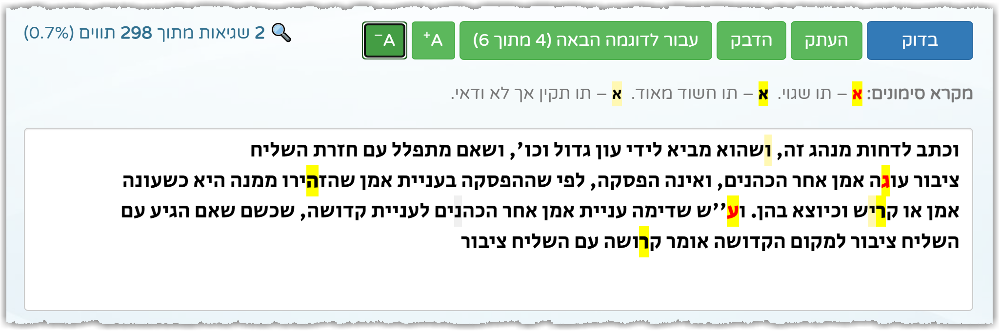
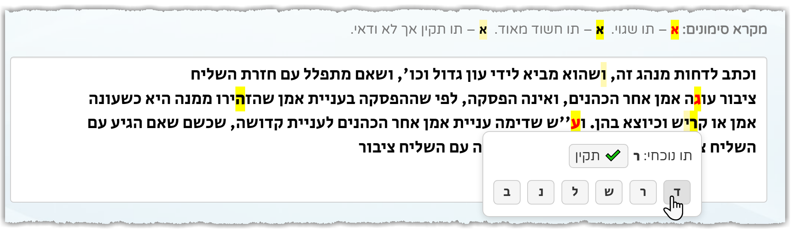

# 🔍 בודק OCR לטקסטים תורניים

**כלי אינטרנטי חדשני לזיהוי תווים חשודים או שגויים בטקסטים בעברית, במיוחד עבור תנ"ך, גמרא, ספרי הלכה ושו"תים.**  
הכלי מבוסס על Transformer מאומן ברמת תו (character-level), ללא צורך בהשוואה למקור – ומזהה תווים שנראים חשודים על פי ההקשר בלבד.

🧪 [לחץ כאן להדגמה חיה >>](https://yakobov-dev.co.il/כלים/OcrChecker.aspx)

⚠️ *שימו לב:* זהו ריפוזיטורי לצורכי הדגמה ותיעוד בלבד. הקוד המקור אינו פומבי.

## תכונות עיקריות
- תמיכה בטקסטים תורניים עתיקים וחדשים (ללא ניקוד).
- תיוג של כל תו: תקין ✅ / חשוד ⚠️ / שגוי ❌.
- ללא תלות ב־API חיצוני – המודל פועל באופן עצמאי.
- מנוע מאומן על מגוון רחב של טקסטים תורניים: תנ"ך, משנה, גמרא, שו"תים ועוד.

## דוגמה
הכנס טקסט עברי (ללא ניקוד) ותקבל סימון תווים שעלולים להיות שגויים, גם אם הם נראים תקינים מבחינת כתיב.

## הדגמה חזותית

### סימון תווים חשודים
  
🔍 בתמונה: סימון אוטומטי של תווים חשודים או שגויים על סמך ההקשר הלשוני בלבד – גם כאשר המילה נראית "נכונה" מבחינת כתיב.

### הצגת טולטיפ עם הצעות תיקון
  
🛠️ בתמונה: בעת ריחוף מעל תו שסומן כשגוי, נפתח טולטיפ ובו ניתן **לסמן את התו כתקין**, או **לבחור אחת מההצעות לתיקון** – לחיצה תחליף את התו בהתאם.

---
## צור קשר

✉️ אם יש לכם שאלות, הצעות או עניין בשיתוף פעולה – מוזמנים לפנות אליי בדוא"ל:  
yaakobov001@gmail.com

---

# 🔍 OCR Checker for Hebrew Religious Texts

**A cutting-edge web tool for detecting suspicious or incorrect characters in unvoweled Hebrew texts – including Torah, Talmud, Halachic works, and Responsa.**  
Powered by a custom-trained Transformer model at the character level – no source reference is needed.

🧪 [Click here for the live demo >>](https://yakobov-dev.co.il/כלים/OcrChecker.aspx)

⚠️ *Note:* This repository is for demonstration and documentation purposes only. The source code is not public.

## Key Features
- Supports traditional and modern Hebrew texts (without vowels).
- Classifies each character as: Valid ✅ / Suspicious ⚠️ / Error ❌.
- Fully self-contained – no external API calls.
- Trained on a wide variety of Hebrew religious texts.

## Example
Paste unvoweled Hebrew text and get character-level markings for potentially corrupted letters, even if they look correct in isolation.

## Visual Demo

### Suspicious character detection
  
🔍 In the image: automatic marking of suspicious or erroneous characters based purely on linguistic context – even if the word appears "correctly" spelled.

### Tooltip with correction suggestions
  
🛠️ In the image: hovering over a character marked as incorrect opens a tooltip where the user can **mark the character as valid**, or **click one of the suggested corrections** to instantly replace the character.

---

## Contact

✉️ For questions, suggestions, or collaboration opportunities – feel free to reach out via email:  
yaakobov001@gmail.com

---

© 2025 Yakobov Software Development. All rights reserved.
